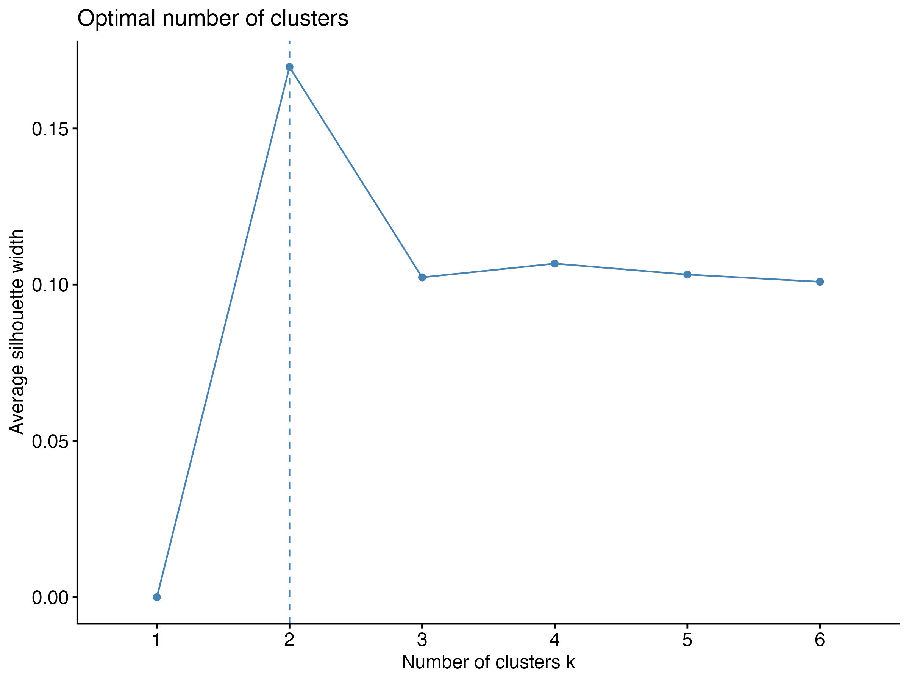
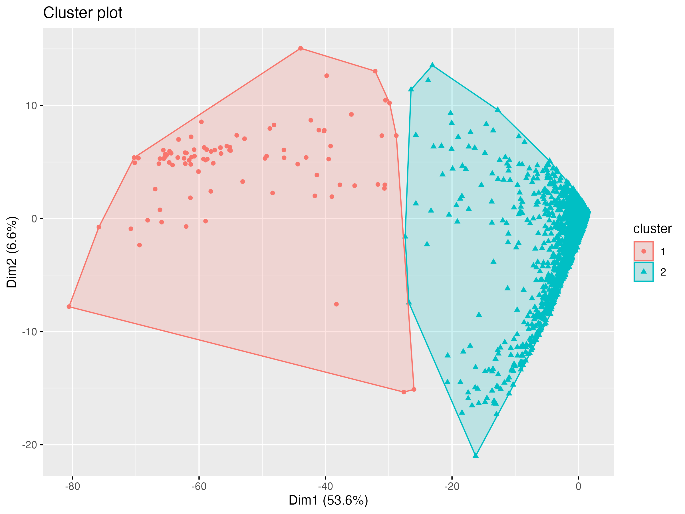
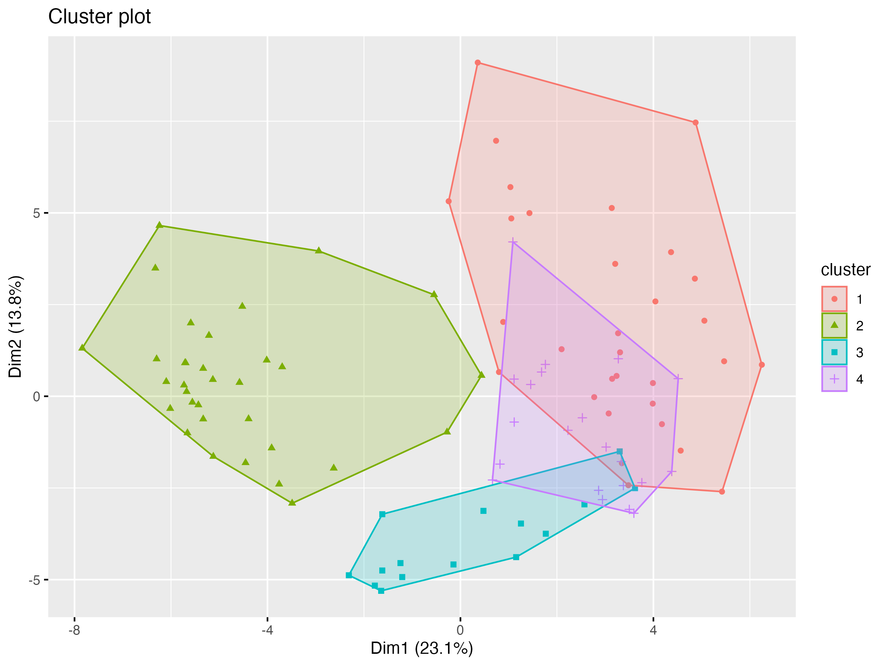

## D: Number of clusters

Using the silhouette score, we can determine the optimal numbers of clusters:

Visually the cluster plots look sparse, no matter the number of clusters or genes. This might be due to 
the pre-normalized Dataset. While using the silhouette method the optimal number of clusters was two, visually four distinct clusters can be determined, which seems to be a better fit.

## Number of genes and how it affects clustering

