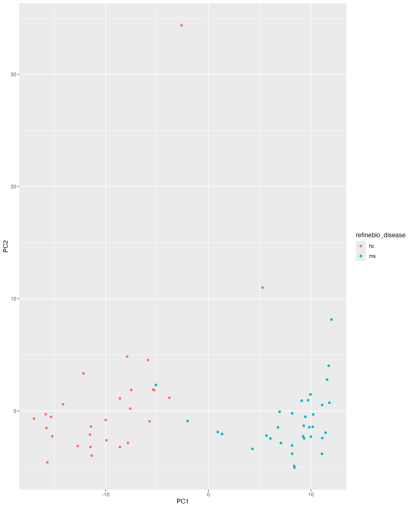
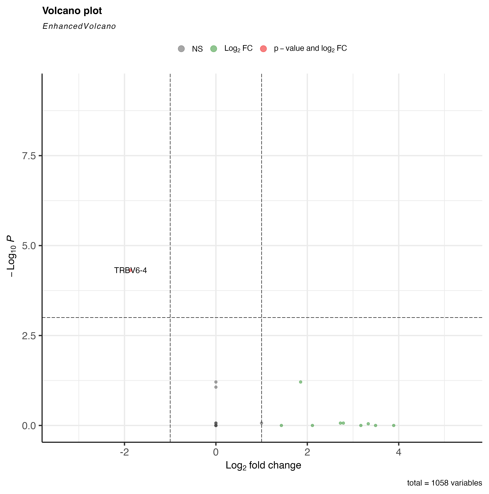

```{R}
# Define file paths
data_dir <- file.path("../../data", "SRP164913")
data_file <- file.path(data_dir, "SRP164913_HUGO.tsv")
metadata_file <- file.path(data_dir, "metadata_SRP164913.tsv")
results_dir <- file.path("results")
plots_dir <- file.path("plots")

# Libraries
library(DESeq2)
library(ggplot2)
library(magrittr)
library(M3C)
library("umap")
# Set seed for reproducible results
set.seed(12345)
```

**Group:** 4, **Date:** 09/25/2024

## Task 1 - Data analysis
### Sample Size
```{r}
data_analysis_df <- read.delim("../../data/SRP164913/SRP164913_HUGO.tsv",header = TRUE, row.names = 1, stringsAsFactors = FALSE)
cat("Number of Genes in the expression matrix: ", dim(df)[1], "\n")
cat("Number of Samples in the expression matrix: ", dim(df)[2], "\n")
```

### Density Plot of Gene Expressions

```{R}
# Get the median of expressions by gene
gene_median <- apply(data_analysis_df, 1, median)
head(gene_median)
gene_median = log2(gene_median +1)
cat("Variance between gene expression medians:", var(gene_median, na.rm = TRUE))
# Create a Data frame from the numerical array
gene_median_df <- data.frame(Median = gene_median)
# Plot the values
ggplot(gene_median_df, aes(x = Median)) + geom_density() + xlab("Gene Expression Count") + ylim(0,1e-2)
```
The density plot shows a Righ Skewed distribution of gene Expression counts with most of the expressions being between zero and 5 but with a few outliers between 10 and 15 expressions.

## Task 2 - Principal Component Analysis
### PCA Plot


### TSNE Plot

```{R}
tsne(filtered_expression_df, labels=as.factor(metadata$refinebio_disease))
```
### UMAP Plot
```{R}
gene <- DESeqDataSetFromMatrix(
  countData = filtered_expression_df,
  colData = metadata,
  design = ~refinebio_disease
)
norm <- vst(gene, nsub=100)
normalized_counts <- assay(norm) %>%
  t() # transpose, row -> sample
results <- umap::umap(normalized_counts)
umap_plot <- data.frame(results$layout) %>%
  tibble::rownames_to_column("refinebio_accession_code") %>%
  dplyr::inner_join(metadata, by = "refinebio_accession_code")
ggplot(
  umap_plot,
  aes(
    x = X1,
    y = X2,
    color = refinebio_disease
  )
) +
  geom_point()
```
## Task 3 - Differential Analysis
Top 50 differentially expressed genes
```{R}
head(top_50)
```

```{r}
# Load necessary libraries
library(readr)

# Read the differential expression data
diff_expr_file <- "C:/Users/Esha/Downloads/Assignment2/bioinfo_project/results/SRP164913_diff_expr_results.tsv"
diff_expr_df <- read_tsv(diff_expr_file)

# Create a grouping variable based on log2FoldChange: 'upregulated' for positive values and 'downregulated' for negative values
diff_expr_df$group <- ifelse(diff_expr_df$log2FoldChange > 0, "upregulated", "downregulated")

# Filter significant genes based on an adjusted p-value threshold (e.g., < 0.05)
significant_genes <- diff_expr_df[diff_expr_df$padj < 0.05, ]

# Perform Wilcoxon rank-sum test between two groups ('upregulated' and 'downregulated')
wilcox_test_results <- wilcox.test(log2FoldChange ~ group, data = significant_genes)

# Print out the results of the Wilcoxon test
print(wilcox_test_results)

# Optionally, create a table of the results to add to your GitHub repository
wilcox_results_table <- data.frame(
  Gene = significant_genes$Gene,
  p_value = wilcox_test_results$p.value
)

# View the first few rows of the results
head(wilcox_results_table)


```
