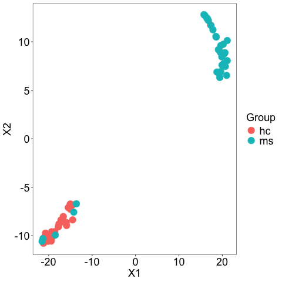
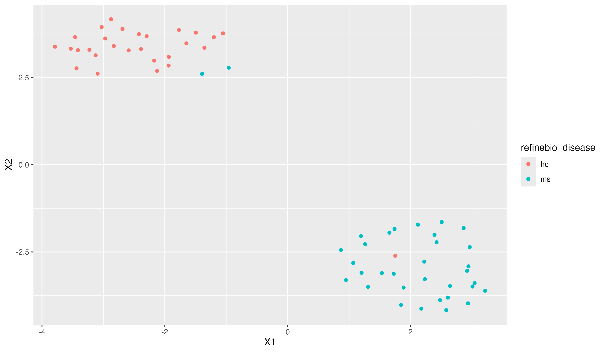
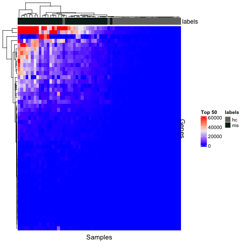
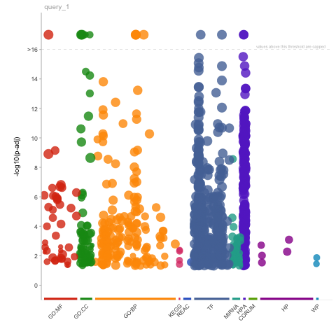

```{R}
# Define file paths
data_dir <- file.path("../../data", "SRP164913")
data_file <- file.path(data_dir, "SRP164913_HUGO.tsv")
metadata_file <- file.path(data_dir, "metadata_SRP164913.tsv")
results_dir <- file.path("../../results")
plots_dir <- file.path("plots")

# Libraries
library(DESeq2)
library(ggplot2)
library(magrittr)
library(M3C)
library("umap")
# Set seed for reproducible results
set.seed(12345)
```

**Group:** 5, **Date:** 09/25/2024
Order to run R scripts: 
(task 1) preprocessing.R
(task 2) PCA_Plot.R
(task 3) DifferentialAnalysis.R
(task 4) heatmap.R
(task 5-HAL) gprofiler2.R

## Task 1 - Data analysis
### Sample Size
```{r}
data_analysis_df <- read.delim("../../data/SRP164913/SRP164913_HUGO.tsv",header = TRUE, row.names = 1, stringsAsFactors = FALSE)
cat("Number of Genes in the expression matrix: ", dim(data_analysis_df)[1], "\n")
cat("Number of Samples in the expression matrix: ", dim(data_analysis_df)[2], "\n")
```
There are 88 samples, however, there are three disease groups: healthy controls, MS subjects, and ham/tsp subjects. To make this a binary problem, from Task 2 onward, we removed the ham/tsp subjects to compare only MS vs healthy controls (hc). This reduces the number of samples to 62. 

### Density Plot of Gene Expressions

```{R}
# Get the median of expressions by gene
gene_median <- apply(data_analysis_df, 1, median)
head(gene_median)
gene_median = log2(gene_median +1)
cat("Variance between gene expression medians:", var(gene_median, na.rm = TRUE))
# Create a Data frame from the numerical array
gene_median_df <- data.frame(Median = gene_median)
# Plot the values
ggplot(gene_median_df, aes(x = Median)) + geom_density() + xlab("Gene Expression Count") + ylim(0,1e-2)
```
The density plot shows a left skewed distribution of gene expression counts with most of the expressions being between 0 and 10 but with a few outliers between 10 and 15. We downloaded the un-normalized data, however when we opened the raw file, most count values were 0 or very close to 0. We suspect the data came pre-normalized, and this is causing some issues. This carries over through the entire assignment. 

## Task 2 - Principal Component Analysis
We were able to get a PCA, tsne, and umap plot following the tutorials. All three show a clear difference between the healthy control (hs) and MS (ms) groups, with a few samples in the midst of the other cluster. The number of crossovers is different. 
### PCA Plot


### TSNE Plot

### UMAP Plot

## Task 3 - Differential Analysis
When we did our differential analysis, because the data was so small and normalized, we had to adjust the filter value to 0.01 or else only ~1000 rows were making it to the DESeqDataSetFromMatrix() step. This was causing our volcano plot to look very sparse. We were able to get a list of the top 50 differentially expressed genes. The results, both the entire table and only the top 50, are stored in the results folder. 
```{R}
top_50_file <- file.path(results_dir, "SRP164913_diff_expr_top_50_results.tsv")
top_50 <- readr::read_tsv(top_50_file)
head(top_50)
```

The volcano plot, while still somewhat sparse, is far more populated than it was with the highly filtered data. Most significant results have a negative log fold change.  

## Task 4 - Heatmap
A heatmap was generated for the top 50 differentially expressed genes. The counts for each gene in the top 50 were extracted and put into the heatmap plot. It was annotated with the two disease groups: ms subjects and healthy control subjects. Since many of our counts are 0 and therefore are not expressed differently, the map is largely blue. 


## Task 5 - Enrichment Analysis
Hannah- gprofiler2
The function gost was used from gprofiler2 to perform enrichment analysis on the differentially expressed data. Disease ontology was used, as the data was differentially expressed between the MS subjects and healthy controls. Only genes with adjusted p-values below 0.05 were put into the function. Two gost results were generated: one that contains all results, significant or not, and one that contained only significant results. The plot (created with gostplot) for the significant results is shown below. It seems there are a few points above the significance threshold.


However, when publish_gosttable(gost_res3) was run, the function would not complete. It would continue to run for over 15 minutes and never produce results. I was unable to generate a table from the results, and when I tried to print the results, it would return NULL for both significant and non-significant gost results. The NULL result is shown below along with the gost function that was run. It is possible that no truly significant results were generated and so the results were empty. 

```{R}
results_dir <- file.path("../../results")
diff_expr_file <- file.path(results_dir, "SRP164913_diff_expr_results.tsv")
library(gprofiler2)
diff_expr_df <- readr::read_tsv(diff_expr_file)
gost_res3 <- gost(
  query = unlist(diff_expr_df[diff_expr_df$padj<0.05, 'Gene']), 
  significant=TRUE, 
  organism = "hsapiens"
  ) 
head(gost_res3$results)

```

When I had initially tried to run gost with every gene name, no p-value factor, it would produce a result that could be printed, but that is not as relevant to our dataset. This does prove that something is off with specifically the differential data, and the function does work. 

Unfortunatly, due to the circumstances described above, no table was generated using the gprofiler2 method. 

## Task 6/7 - Joint Enrichment Analysis Table
