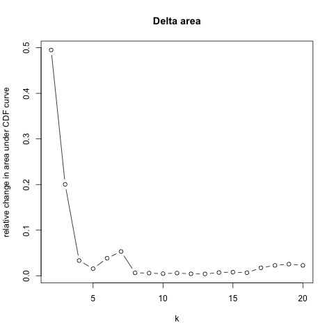
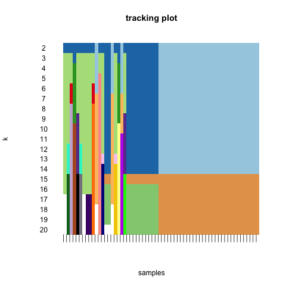
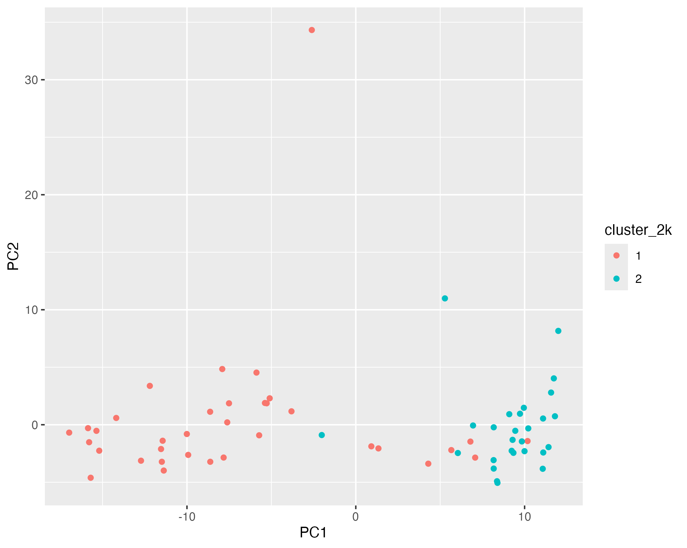
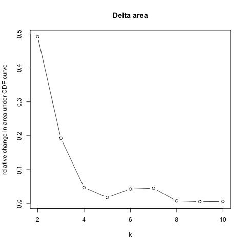
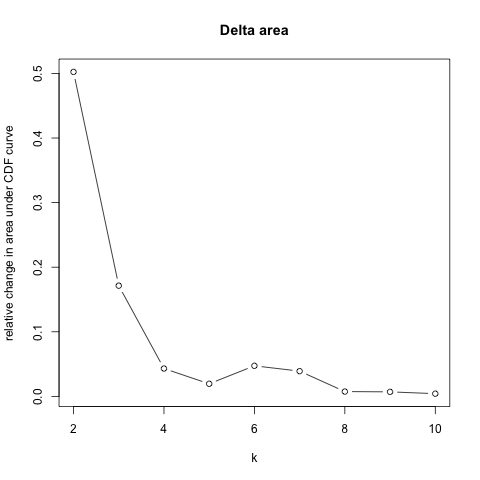
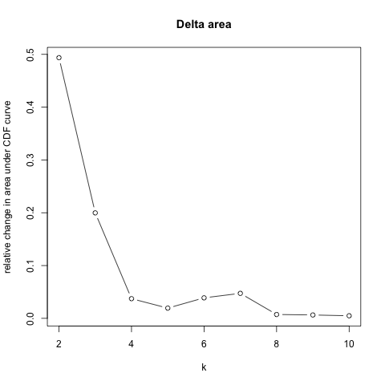
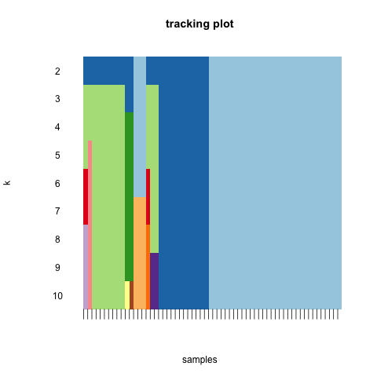
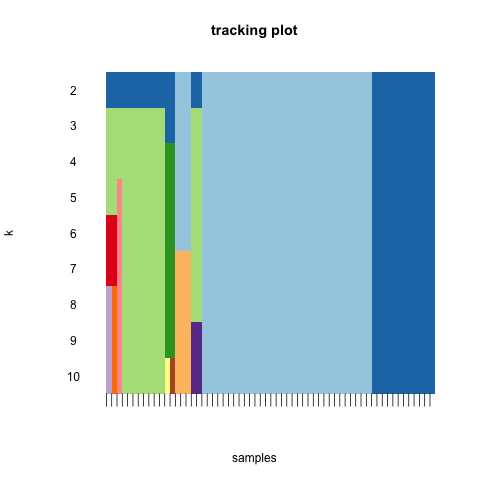

**Group: 5, Date: 10/23/24**

**Hannah Luft**

Code: consensusClusterPlus.R

Results: results/consensusClusterPlusResults/

## Unsupervised Analysis- ConsensusClusterPlus

I used Consensus Cluster Plus as my clustering algorithm. To prepare the expression data, I used the top differentially expressed genes identified in Assignment 2. Due to those results, only 1980 genes were available for clustering after removing ones with "NA" differential expression significance. 

The way Consensus Cluster Plus works, when you put in a k, it runs clustering for all k values up to that k; an input of k=6 returns results for k=2, k=3, k=4, k=5, and k=6, along with some graphs showing the changes as k increases. The clustering method also produces consensus matrices for each k, a consensus cumulative distribution function (CDR) plot, delta area plot, tracking plot, cluster consensus plot, and item consensus plot. 

I ran Consensus Cluster Plus with all 1980 genes for k=6 (used on the tutorial), k=10, and k=20. I then ran it at k=10 for the top 10 differentially expressed genes, top 100, and top 1000 (g=10, g=100, g=1000). The full results for each can be found in the results -> consensusClusterPlusResults folder, subdivided by each test.

### Identifying Clusters and Manipulating k

The delta area plot, shown below for k=2 through k=20, displays the relative change in area under the CDF plot, to show the relative increase in consensus. As you can see, the plot does decrease as expected with a higher k value, but has two notable "bumps" at around k=7 and k=12. I was not entirely sure how to interpret this, so I looked at other results produced to see if I could figure out the optimal k value. 



The tracking plots, one for k=20 and one for k=6, are shown below, and display how different samples (x axis) change groups as k increases. As seen in the k=6 plot, majority of samples belong to one cluster, even as more clusters are added. In the k=20 plot, the light blue group still dominates all the way to k=20, but there are many cluster membership changes as more clusters were added. Unstable membership implies unstable clusters. The dark blue group, introduced in k=2, and the light green group, in k=3, do appear quite stable, but have very few members. 

{width=50%} {width=50%}
\begin{center}
Figure 2: Tracking Plot up to k=20  \hspace{2cm} Figure 3: Tracking Plot up to k=6
\end{center}

At this point, I was still unsure as to what the optimal k value was. So, I decided to try and plot the clusters to see what was happening. The plots are shown below. There is one outlier sample that consistently gets its own cluster, and all the other results are clustered to one side. This did not look at all like the PCA plots we were able to generate in Assignment 2, despite using the same PCA method. I was confused, and wondered where the two disease groups (healthy control/hc and multiple sclerosis/ms) were. So I plotted those as well, and they are overlapping! I was using a reduced set of the original dataset only containing the relevent 1980 genes, so I attribute this discrepency to having less rows of data entered into the PCA plot generator. 

{width=50%} {width=50%} 
\begin{center}
Figure 4: Clusters k=2  \hspace{3cm} Figure 5: Clusters k=3
\end{center}

{width=50%}
\begin{center}
Figure 6: Clusters By Disease Group
\end{center}

At this point, it very strongly appeared the cluster method was working, and our dataset just didn't have meaningful clusters for the top 1980 differentially expressed genes (as determined by Assignment 2), as all samples were clustered together with this method. 

### Changing the Number of Genes

I reran clusterConsensusPlus for gene groups of 10, 100, and 1000 (since I had a maximum of 1980 genes, I could not try 10000 genes). Displayed are the delta area and tracking plots for each number of genes. 

{width=33%} {width=33%} {width=33%}
\begin{center}
Figure 7: Delta Area Plots for g=10, g=100, and g=1000
\end{center}

{width=33%} {width=33%} {width=33%}
\begin{center}
Figure 8: Tracking Plots for g=10, g=100, and g=1000
\end{center}

There is almost no difference in the clustering results with different numbers of genes. In fact, differences do not even begin to appear in the tracking plots until k=8 (the samples in g=1000 ended up in a different order, but it can be seen it has the same number of samples in the same groups until k=8).


Chi squared testing was performed on each pair of clustering results for both k=2 and k=3. These two ks were chosen because k=2 would make sense for our two disease group dataset, and k=3 because it seems just as likely to be valid, not to mention that the original dataset had three disease groups (the third group had been cut). The results are shown in the table below and are stored as a csv file in the consensusClusterPlusResults folder. Test names are labeled "chi_group1vgroup2_kvalue", where the groups are the number of genes used. For example, chi_10v100_2k is the chi-squared test for clustering with k=2 for 10 genes versus k=2 for 100 genes. 

```{r, echo=FALSE, warning=FALSE}
df <- read.csv("../../results/consensusClusterPlusResults/ConsensusClusterPlus_X-Squared_Table.csv")
knitr::kable(df, caption="Table of Chi Squared Values")
```

As you can see, the X-Squared value for every test was 0, and the p-value 1, meaning there is no significance to any differences in these results. The number of genes did not effect the results. 

### Alluvial Diagram
An alluvial diagram was generated for g=1980 to show cluster membership change from the disease groups to k=2 and k=3. Once again, this displays the dominance of cluster group 1, with very small membership in any other cluster groups. 

{width=100%}
\begin{center}
Figure 9: Alluvial Diagram
\end{center}

### Heatmap with Dendrograms

Each member of the group generated their own heatmaps. 

The heatmap for Consensus Cluster Plus is shown below, with annotations for the two disease groups, clusters for k=2, and clusters for k=3. The input was the top 1980 differentially expressed genes from the samples of healthy control (hc) and multiple sclerosis (ms) subjects. As mentioned in Assignment 2, many values of our dataset are 0, which is reflected in the large portion of dark blue values on the heatmap. 

{width=80%}
\begin{center}
Figure 10: Consensus Cluster Plus Heatmap
\end{center}


### Statistics

The results of the chi-squared test of independence between the disease groups and clusters can be found at the bottom of the table in the section "Changing the Number of Genes," displayed again here. Tests were performed comparing the disease groups with the two clusters from k=2 and three clusters from k=3. Unlike the results comparing the cluster results with differing numbers of genes, these tests did not result in X-square values of 0 and p-values of 1. However, the results were still not very significant. 

All results were adjusted for multiple hypothesis testing using p.adjust. The results of the p.adj are found in the p_adj column of the table. The adjusted p values were all 1, indicating no significance in results. 

```{r, echo=FALSE, warning=FALSE}
df <- read.csv("../../results/consensusClusterPlusResults/ConsensusClusterPlus_X-Squared_Table.csv")
knitr::kable(df, caption="Table of Chi Squared Values")
```

