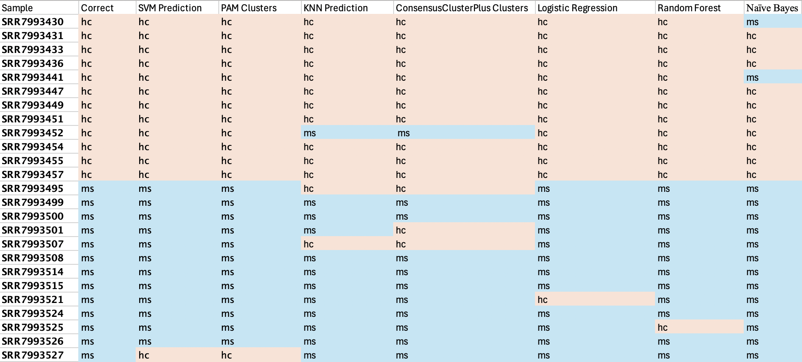
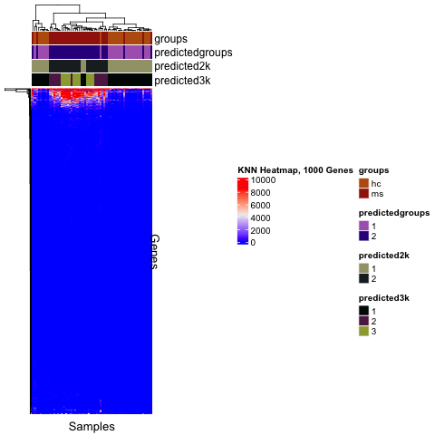

```{r setup, include=FALSE}
knitr::opts_chunk$set(echo = TRUE)
```

**Group: 5, Date: 10/23/24**

**Hannah Luft**

Code: KNN.R

## Supervised Analysis: K Nearest Neighbors

For this assignment, the K Nearest Neightbors (KNN) algorithm was run on the top 5000 most variable genes from our dataset. It was used to predict the disease groups (healthy control(hc) vs multiple sclerosis(ms)), and the clusters from Consensus Cluster Plus, at both k=2 and k=3 (two and three cluster groups). 

The algorithm was trained using a random set of 60% of the samples. The training sample set was kept consistent for the purposes of direct comparison of performance (they were trained with the same expression data from the same samples each time) between scenarios \textit{and} machine learning algorithms each member of the group used.  

### Results and Confusion Matrices 

KNN was trained and tested with 5000 genes, 1000 genes, 100 genes, and 10 genes, for each of the three above stated group predictions (disease, k=2, and k=3). Interestingly, the KNN algorithm performed better with fewer genes. We suspect that this is because our dataset has very few genes with significant differential expression and variance, so adding more gene data is actually just introducing bad training data, wherein most of the expression data is just 0. Thus, the fewer genes, the better the training data, and the better the results. The confusion matrices are shown below, grouped by disease, k=2 clusters, and k=3 clusters; sub-grouped by gene amounts (5000, 1000, 100, and 10). 


\newpage


```{r confusionMatrices, echo = FALSE}
# t1 <- as.data.frame.matrix(knn_disease_og[[2]])
# t2 <- as.data.frame.matrix(knn_2k_og[[2]])
# t3 <- as.data.frame.matrix(knn_3k_og[[2]])
# t4 <- as.data.frame.matrix(t1000_disease_knn[[2]])
# t5 <- as.data.frame.matrix(t1000_2k_knn[[2]])
# t6 <- as.data.frame.matrix(t1000_3k_knn[[2]])
# t7 <- as.data.frame.matrix(t100_disease_knn[[2]])
# t8 <- as.data.frame.matrix(t100_2k_knn[[2]])
# t9 <- as.data.frame.matrix(t100_3k_knn[[2]])
# t10 <- as.data.frame.matrix(t10_disease_knn[[2]])
# t11 <- as.data.frame.matrix(t10_2k_knn[[2]])
# t12 <- as.data.frame.matrix(t10_3k_knn[[2]])

# td <- merge(t1,t4, by=0, all=TRUE)
# td <- merge(td, t7, by=0, all=TRUE)
# td <- merge(td, t10, by=0, all=TRUE)
# td$Row.names <- NULL
# td$Row.names <- NULL
# td$Row.names <- NULL
# rownames(td) <- c("hc", "ms")
# names(td) <- c("5000 hs", "5000 ms", "1000 hs", "1000 ms", "100 hc", "100 ms", "10 hc", "10 ms")


# t2k <- merge(t2,t5,by=0)
# t2k <- merge(t2k,t8, by=0)
# t2k <- merge(t2k,t11, by=0)
# t2k$Row.names <- NULL
# t2k$Row.names <- NULL
# t2k$Row.names <- NULL
# rownames(t2k) <- c("Cluster 1", "Cluster 2")
# names(t2k) <- c("5000 1", "5000 2", "1000 1", "1000 2", "100 1", "100 2", "10 1", "10 2")

# t3k <- merge(t3,t6,by=0)
# t3k <- merge(t3k,t9, by=0)
# t3k <- merge(t3k,t12, by=0)
# t3k$Row.names <- NULL
# t3k$Row.names <- NULL
# t3k$Row.names <- NULL
# rownames(t3k) <- c("Cluster 1", "Cluster 2", "Cluster 3")
# names(t3k) <- c("5000 1", "5000 2", "5000 3", "1000 1", "1000 2", "1000 3", "100 1", "100 2", "100 3", "10 1", "10 2", "10 3")
# 
# #print(td)
# knitr::kable(td, caption = "Disease Confusion Matrices")
# #print(t2k)
# knitr::kable(t2k, caption = "k=2 Confusion Matrices")
# #print(t3k)
# knitr::kable(t3k, caption = "k=3 Confusion Matrices")


#knitr::kable(list(t1,t2,t3), caption="5000 Gene Prediction Confusion Matrices", booktabs=TRUE, valign='t')
#knitr::kable(knn_2k_og[[2]], caption="5000 Gene k=2 Cluster Prediction Confusion Matrix")
#knitr::kable(knn_3k_og[[2]], caption="5000 Gene k=3 Cluster Prediction Confusion Matrix")

#knitr::kable(t1000_disease_knn[[2]], caption="1000 Gene Disease Prediction Confusion Matrix")
#knitr::kable(t1000_2k_knn[[2]], caption="1000 Gene k=2 Cluster Prediction Confusion Matrix")
#knitr::kable(t1000_3k_knn[[2]], caption="1000 Gene k=3 Cluster Prediction Confusion Matrix")

#knitr::kable(t100_disease_knn[[2]], caption="100 Gene Disease Prediction Confusion Matrix")
#knitr::kable(t100_2k_knn[[2]], caption="100 Gene k=2 Cluster Prediction Confusion Matrix")
#knitr::kable(t100_3k_knn[[2]], caption="100 Gene k=3 Cluster Prediction Confusion Matrix")

#knitr::kable(t10_disease_knn[[2]], caption="10 Gene Disease Prediction Confusion Matrix")
#knitr::kable(t10_2k_knn[[2]], caption="10 Gene k=2 Cluster Prediction Confusion Matrix")
#knitr::kable(t10_3k_knn[[2]], caption="10 Gene k=3 Cluster Prediction Confusion Matrix")
```


## ROC AUC
The area under the curve (AUC) was calculated for each scenerio's receiver operating characteristic (ROC) curve using the pROC library. The AUC results are shown below. Matching the KNN predictions and confusion curves, the KNN models did better with smaller numbers of genes. For 1000 and 5000 genes, the AUC values were 0.5, indicating that it is no better at predicting the groups than chance. This supports the bad input data argument. Additionally, the KNN model was best at predicting the cluster groups for k=2, more so than predicting the actual disease groups. 


```{r auc, echo=FALSE}
#insert AUC values
# auc_d_vals <- c(auc5000d, auc1000d, auc100d, auc10d)
# auc_2k_vals <- c(auc50002k, auc10002k, auc1002k, auc102k)
# auc_3k_vals <- c(auc50003k, auc10003k, auc1003k, auc103k)
# auc_titles <- c("5000 Genes", "1000 Genes", "100 Genes", "10 Genes")
# auc_table <- data.frame(auc_d_vals, auc_2k_vals, auc_3k_vals, row.names = auc_titles)
# names(auc_table) <- c("AUC Disease", "AUC k=2", "AUC k=3")
# knitr::kable(auc_table, caption="AUC Value Table")
```

## Group Comparison of Models

The results of each group member's unsupervised clusters and supervised predictions for the test set of samples were tabulated. My unsupervised clustering method was Consensus Cluster Plus, and as mentioned my supervised analysis algorithm was K Nearest Neighbors. The KNN results listed are my best results, from running KNN with 10 genes on the disease groups, and the Consensus Cluster Plus results are from the k=2 clusters also at 10 genes. While neither algorithm was able to perfectly predict disease groups, they were fairly consistent with each other, with only one mismatching sample. 



## Heatmap and Dendrogram

A heatmap with dendrograms was created from the results using the Complex Heatmap library. It contains annotation bars of the true disease groups, the predicted disease groups, predicted cluster groups for k=2, and predicted cluster groups for k=3. The top 1000 genes by variance are plotted because the heatmap would not render with a higher number; additionally, the most varied and thus most relavent genes are all contained within the top 100 genes, so adding the next 4000 would not add particularly important information, only more blue (0) values. 




